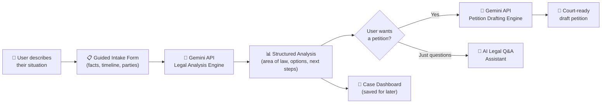

<div align="center">

</div>

<p align="center">
  
</p>

<br>

---

## 📑 Table of Contents

- [The Problem](#-the-problem)
- [What Munsif.ai Does](#-what-munsif.ai-does)
- [Live App](#-live-app)
- [Features](#-features)
- [How It Works](#-how-it-works)
- [The AI Feature](#-the-ai-feature)
- [Tech Stack](#-tech-stack)
- [Screenshots](#-screenshots)
- [Getting Started](#-getting-started)
- [Project Status](#-project-status--known-limitations)
- [Author](#-author)

---

## 🧩 The Problem

<table>
<tr>
<td>

Most people in Pakistan who face a legal issue — a wrongful termination, a landlord dispute, a consumer complaint, workplace harassment — have **no idea where to start.**

Hiring a lawyer just to answer *"do I even have a case, and what law applies?"* costs money most people don't have. Free legal aid clinics exist, but they're scarce, slow, and hard to reach outside big cities.

> **The gap Munsif.ai fills:** the space between *"something unfair happened to me"* and *"I'm sitting in front of a lawyer with a clear story and a draft in hand."*

</td>
</tr>
</table>

**Who it's for:** ordinary citizens with no legal background, and junior legal practitioners or law students who want a faster first-draft intake and petition process.

**What it deliberately is *not*:** a replacement for a licensed lawyer. Every AI output in the app carries an explicit disclaimer and is designed as a *first-step assistant* — this is baked directly into the AI's own instructions, not just a footer note (see [The AI Feature](#-the-ai-feature)).

---

## 💡 What Munsif.ai Does

```
  User describes their problem  →  Guided intake structures it  →  AI analyzes the law
        in plain language              (facts, timeline,           and explains options
                                          parties, evidence)                 ↓
                                                                    AI drafts a court-ready
                                                                       petition
```

In three steps: **explain → understand → draft.** No legal vocabulary required from the user at any point.

---

## 🌐 Live App

<div align="center">

### 👉 **[munsif-ai.vercel.app](https://YOUR-DEPLOYMENT-URL.vercel.app)**

*Replace with your real Vercel URL before submitting.*

</div>

No sign-up required to try the Intake → Analysis → Petition flow. *(Note here if any feature, like the Case Dashboard, sits behind a free account.)*

---

## ✨ Features

| | Feature | What it does |
|---|---|---|
| 🏠 | **Interactive Landing Page** | Explains what Munsif.ai does and who it's for before the user commits to filling anything out. |
| 📋 | **Guided Legal Intake** | Multi-step form capturing what happened, when, who was involved, and what evidence exists — in plain language. |
| ⚡ | **AI Legal Analysis** | Structured breakdown: likely legal area, relevant section (when confident), realistic options, and next steps. |
| 📝 | **Automated Petition Generator** | Converts the intake + analysis into a formatted, court-ready draft petition. |
| 💬 | **AI Legal Q&A Assistant** | Conversational follow-up chat for clarifying terms or next steps once an analysis exists. |
| 📁 | **Case Dashboard** | Save, revisit, and manage multiple case files and their generated drafts. |
| 🌐 | **Multilingual Support** | Interface and AI responses usable beyond legal English. |

<<<<<<< HEAD
> ⚠️ **Only claim what's actually wired up.** If Case Dashboard storage or multilingual coverage is partial, say so under [Project Status](#-project-status--known-limitations) rather than here — an honest features list survives grader scrutiny; an inflated one doesn't.
=======
>>>>>>> 8cdb031489a9c05b3cbc910b477c0a3487b48862

---

## 🔄 How It Works



---

## 🤖 The AI Feature

Munsif.ai's core intelligence is a **two-stage Gemini-powered engine**: a Legal Analysis stage and a Petition Drafting stage. Both take *structured* intake data rather than open-ended chat input — this constrains the model to stay consistent and sharply reduces the risk of hallucinated legal citations, which matters when the output could shape someone's real decisions.

<details>
<summary><strong>🔍 System Prompt — Legal Analysis Engine</strong> (click to expand)</summary>

```
You are Munsif.ai, a legal information assistant helping ordinary citizens in Pakistan
understand a legal problem they have described. You are NOT a licensed lawyer, and you
must never claim to be one or guarantee a legal outcome.

You will receive a structured intake describing:
- What happened (the user's own account of events)
- When it happened (timeline)
- Who was involved (parties)
- Any evidence or documents mentioned

Your task: produce a clear, structured legal analysis with the following sections,
in this order:

1. SUMMARY — restate the situation in 2-3 plain sentences, confirming you understood
   it correctly.
2. LIKELY LEGAL AREA — name the general area of law (e.g. labor law, tenancy law,
   consumer protection, family law) and, if reasonably identifiable, the relevant
   statute or section. If unsure which section applies, say so explicitly rather than
   guessing a specific citation.
3. YOUR OPTIONS — 2-4 realistic paths (e.g. send a legal notice, file a complaint with
   a specific authority, approach a specific court/tribunal), ordered from least to
   most formal/costly.
4. WHAT TO DO NEXT — 2-3 concrete, immediate next steps (documents to gather, people
   to contact).
5. IMPORTANT — a mandatory closing note, in these exact terms: "This is general legal
   information, not legal advice. Please confirm these details with a licensed advocate
   before taking any formal action."

Rules:
- Never fabricate a law, section number, or case citation you are not reasonably
  confident about. Say "a lawyer should confirm the exact section" instead of guessing.
- Never promise a specific outcome ("you will win") — describe likelihood and factors only.
- Keep language plain; explain any unavoidable legal term immediately.
- If the intake describes an emergency (immediate danger, ongoing violence, custody
  emergency), say so clearly at the very top of the response and advise contacting
  emergency services or a lawyer immediately, before anything else.
```

</details>

<details>
<summary><strong>📝 System Prompt — Petition Drafting Engine</strong> (click to expand)</summary>

```
You are Munsif.ai's petition drafting engine. You will receive a completed legal intake
and its corresponding analysis. Produce a formally structured draft petition suitable
for a Pakistani court or relevant authority, using standard petition formatting:

- Title/heading (court or authority name — use "[COURT NAME]" if not specified)
- Parties (Petitioner / Respondent)
- Facts of the case, numbered, drawn only from what the user provided
- Prayer/relief sought, based on the option the user selected

Rules:
- Use only facts explicitly present in the intake. Never invent dates, names, or events.
- Use formal but plain legal drafting language.
- Insert clearly marked placeholders (e.g. "[INSERT DATE]") for anything the intake
  did not provide, rather than guessing.
- End every draft with: "DRAFT ONLY — must be reviewed and formatted by a licensed
  advocate before filing."
```

</details>

**Why this design:** forcing a fixed five-section output (analysis) and a placeholder-based template (petition) makes the AI's output predictable and independently checkable — something a non-lawyer user, or a grader, can verify line by line rather than trusting a free-flowing chatbot answer.

---

## 🛠️ Tech Stack

<div align="center">

| Layer | Technology |
|---|---|
| **Frontend** | React 18 + TypeScript |
| **Build Tool** | Vite 6 |
| **Styling** | Tailwind CSS |
| **Animation** | Framer Motion |
| **Icons** | Lucide React |
| **AI Model** | Google Gemini API (`@google/genai`) |
| **Hosting** | Vercel |
| **Version Control** | Git + GitHub |

</div>

---

## 📸 Screenshots

<div align="center">

| Landing Page | Guided Intake |
|---|---|
|  |  |

| AI Legal Analysis | Generated Petition Draft |
|---|---|
|  |  |

</div>

> 📌 Replace these with real screenshots from your **deployed** app (not localhost) — save them into a `/screenshots` folder in your repo using the exact filenames above, or update the paths to match yours. This is one of the explicit grading criteria — don't skip it.

---

## 🚀 Getting Started

### Prerequisites
- [Node.js](https://nodejs.org/) v18.0.0+
- npm or yarn
- A **Google Gemini API key** — free at [Google AI Studio](https://aistudio.google.com/)

### 1️⃣ Clone the repository
```bash
<<<<<<< HEAD
git clone https://github.com/YOUR-USERNAME/munsif-ai.git
cd munsif-ai
=======
git clone https://github.com/alishamaryamhabib777/insaaf-ai.git
cd insaaf-ai
>>>>>>> 8cdb031489a9c05b3cbc910b477c0a3487b48862
```

### 2️⃣ Install dependencies
```bash
npm install
```

### 3️⃣ Configure environment variables
Create a `.env.local` file in the project root:
```env
GEMINI_API_KEY=your_api_key_here
```

### 4️⃣ Run the dev server
```bash
npm run dev
```
App runs at `http://localhost:5173`.

### 5️⃣ Build for production
```bash
npm run build
```

### 6️⃣ Deploy your own copy
1. Push your repo to GitHub.
2. Import it into [Vercel](https://vercel.com/new).
3. Add `GEMINI_API_KEY` as an environment variable in Vercel's project settings.
4. Deploy.

---

<<<<<<< HEAD
## 📌 Project Status & Known Limitations

- [ ] Multilingual support currently covers: *[list actual languages implemented]*
- [ ] Case Dashboard persistence: *[state whether it's local storage or a real database]*
- [x] Legal analysis is informational only, not legal advice — enforced both in-app and inside the AI's own system prompt.

Being upfront about what's incomplete here is intentional — it's more credible than a features list that overclaims.

---

=======
>>>>>>> 8cdb031489a9c05b3cbc910b477c0a3487b48862
## 👩‍💻 Author

<div align="center">

Built by **Alisha Maryam Habib** for the **Prime Minister's Youth Program Pak — Gen, Agentic AI Course** final project.

[](https://github.com/alishamaryamhabib777)

</div>
