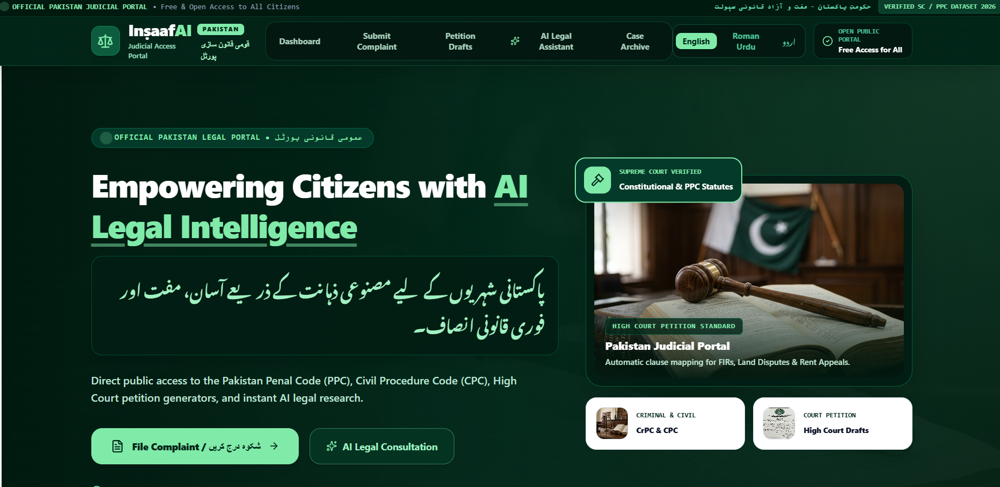
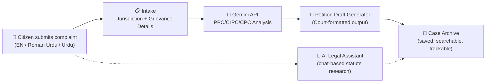
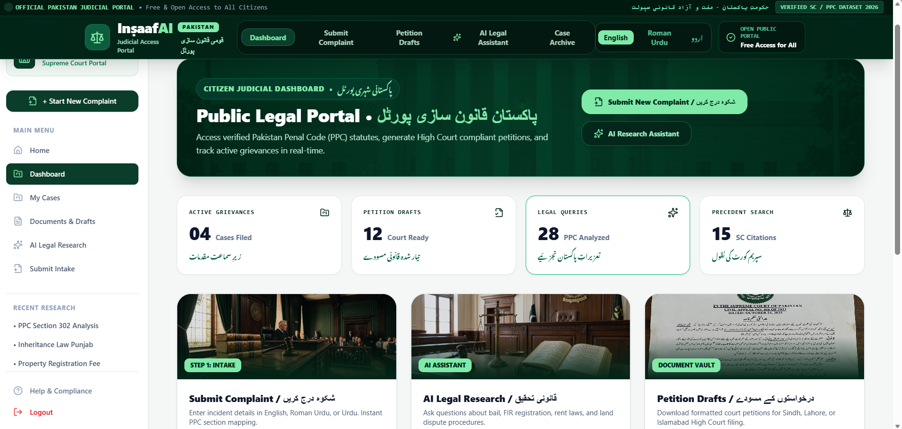
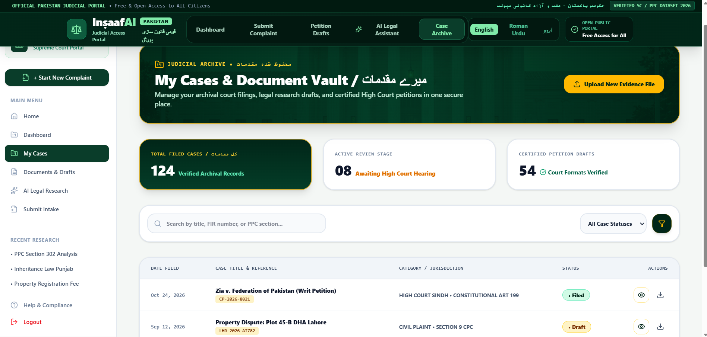
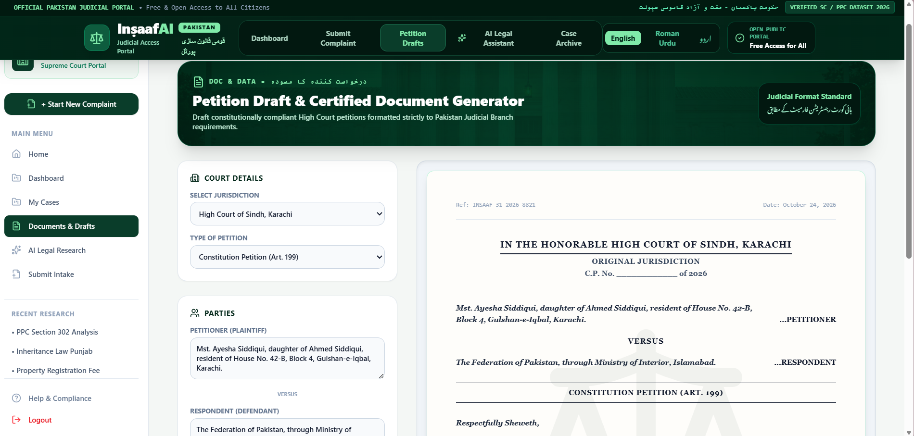
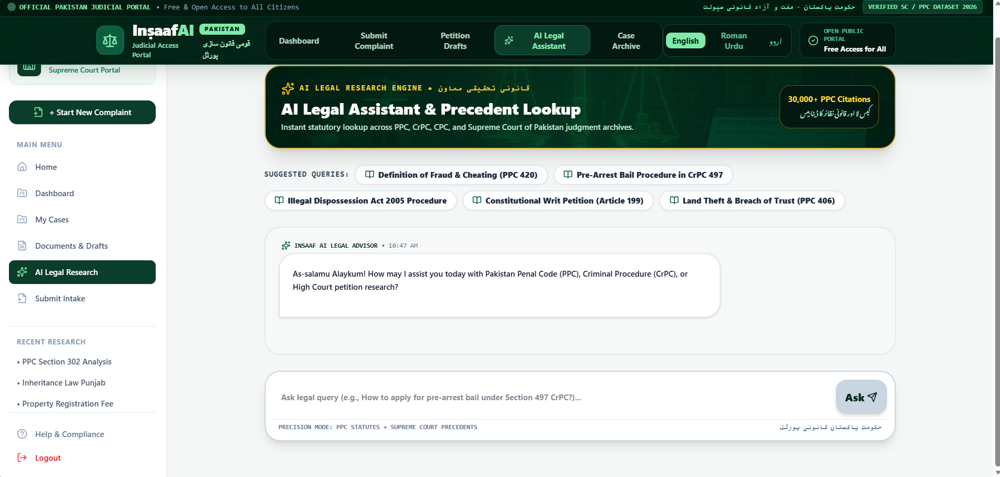
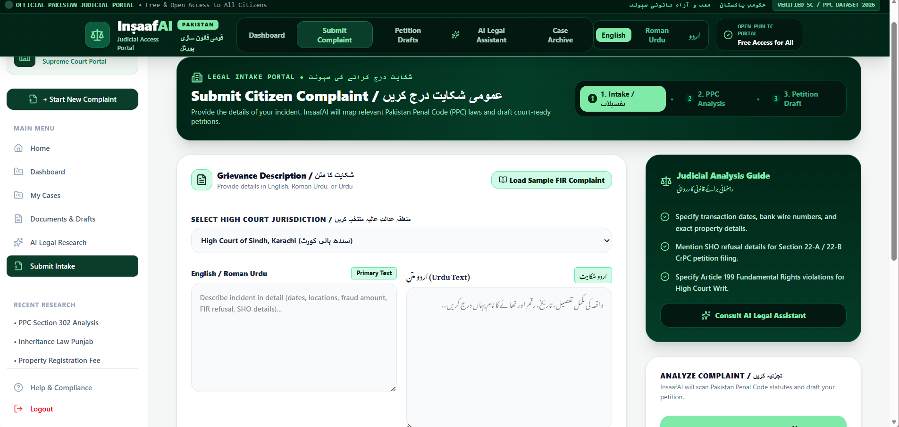

<div align="center">

# ⚖️ Munsif.AI
### منصف — *"Judge"*

**A Pakistan-focused legal intake, research, and petition-drafting portal — powered by AI.**

[](https://vitejs.dev/)
[](https://reactjs.org/)
[](https://www.typescriptlang.org/)
[](https://tailwindcss.com/)
[](https://ai.google.dev/)
[](https://vercel.com/)

**[🔴 Live App](https://munsifai.vercel.app/) &nbsp;·&nbsp; [📖 Features](#-features) &nbsp;·&nbsp; [🤖 AI Engine](#-the-ai-feature) &nbsp;·&nbsp; [🚀 Run Locally](#-getting-started)**

</div>

<p align="center">
  
</p>

<br>

> ⚠️ **Disclaimer:** Munsif.AI is an independent student project built for a training program, not an official service of the Government of Pakistan, the Supreme Court, or any judicial body. It provides general legal information via AI, not legal advice, and is not affiliated with or endorsed by any court. Please make sure your in-app copy reflects this too.

---

## 📑 Table of Contents

- [The Problem](#-the-problem)
- [What Munsif.AI Does](#-what-munsifai-does)
- [Live App](#-live-app)
- [Features](#-features)
- [How It Works](#-how-it-works)
- [The AI Feature](#-the-ai-feature)
- [Tech Stack](#-tech-stack)
- [Screenshots](#-screenshots)
- [Getting Started](#-getting-started)
- [Author](#-author)

---

## 🧩 The Problem

Most people in Pakistan who face a legal issue — a property dispute, an FIR that police refuse to register, a wrongful eviction, a fraud complaint — have **no easy way to understand their situation or take the first formal step.**

Understanding which law applies (PPC, CrPC, CPC, or a constitutional article), and turning a personal grievance into a properly formatted High Court petition, normally requires paying a lawyer just to get started. Free legal aid exists, but it's scarce and hard to reach outside big cities, and most citizens don't know the difference between a complaint, an FIR, and a writ petition in the first place.

**Munsif.AI closes that gap.** A citizen describes what happened, in English, Roman Urdu, or Urdu — and the platform maps it to the relevant Pakistani statute, generates a court-ready petition draft, and gives them a place to research their rights and manage every case they file, in one dashboard.

**Who it's for:** citizens with a legal grievance and no legal background, and legal practitioners or students who want a faster first-draft intake and petition workflow.

---

## 💡 What Munsif.AI Does

```
Citizen describes incident   →   AI maps it to PPC/CrPC/CPC   →   Formatted petition
 (English / Roman Urdu / Urdu)      statutes & explains options        is generated
                                              ↓                              ↓
                                     AI Legal Assistant chat        Saved to Case Archive
                                     for follow-up questions         for tracking & reuse
```

Everything runs through one flow: **describe → analyze → draft → track.**

---

## 🌐 Live App

<div align="center">

### 👉 **[munsif-ai.vercel.app](https://munsifai.vercel.app/)**

</div>

Open the link, go to **Submit Complaint** to try the full intake → analysis → petition flow, or jump straight into **AI Legal Assistant** to ask a legal question.

---

## ✨ Features

| | Feature | What it does |
|---|---|---|
| 🏠 | **Bilingual Landing Page** | Introduces the platform in English and Urdu, with quick entry points to file a complaint or start an AI consultation. |
| 📊 | **Citizen Dashboard** | At-a-glance stats — active grievances filed, petition drafts ready, legal queries analyzed, and precedent searches run — plus quick links into each workflow. |
| 📋 | **Submit Complaint (Guided Intake)** | A 3-step flow (*Intake → PPC Analysis → Petition Draft*). Citizens describe their incident in English, Roman Urdu, or Urdu, select their High Court jurisdiction, and get guided prompts (e.g. "mention SHO refusal details," "specify Article 199 violations") to make their complaint usable. |
| ⚡ | **AI Legal Assistant** | A chat-based research assistant for statutory lookup across PPC, CrPC, and CPC, with suggested queries (e.g. *"Pre-Arrest Bail Procedure in CrPC 497"*, *"Land Theft & Breach of Trust (PPC 406)"*) so users who don't know legal terms can still get started. |
| 📝 | **Petition Draft & Document Generator** | Select jurisdiction (e.g. High Court of Sindh, Karachi) and petition type (e.g. Constitution Petition, Art. 199), enter petitioner/respondent details, and get a fully formatted, court-style petition draft rendered live as you fill the form. |
| 📁 | **Case Archive & Document Vault** | Every filed complaint and generated draft is saved with a case title, reference number, jurisdiction, and status (*Filed* / *Draft*), searchable by title, FIR number, or PPC section. |
| 🌐 | **English / Roman Urdu Toggle** | Full interface switch between English and Roman Urdu, so the app doesn't assume legal or English fluency. |


---

## 🔄 How It Works



---

## 🤖 The AI Feature

Munsif.AI's AI layer, powered by the **Google Gemini API**, does two jobs: it runs the **complaint-to-statute analysis** behind the Submit Complaint flow, and it powers the **AI Legal Assistant** chat for open-ended legal research. Both are driven by system prompts written specifically to keep the model factual, non-hallucinatory on legal citations, and clear that it is not a substitute for a licensed advocate.

<details>
<summary><strong>🔍 System Prompt — Complaint Analysis & Petition Engine</strong> (click to expand)</summary>

```
You are Munsif.AI, a legal information assistant helping citizens in Pakistan turn a
described grievance into a structured legal analysis and a draft petition. You are NOT
a licensed lawyer and must never claim to be one or guarantee a legal outcome.

You will receive:
- A free-text grievance description (may be in English, Roman Urdu, or Urdu)
- The selected High Court jurisdiction
- Any details provided (dates, locations, FIR/SHO details, amounts, parties involved)

Your task, in this order:

1. UNDERSTAND — restate the grievance in 2-3 plain sentences to confirm you understood
   it correctly, in the same language style the user wrote in.
2. STATUTE MAPPING — identify the likely relevant Pakistan Penal Code (PPC), Code of
   Criminal Procedure (CrPC), Civil Procedure Code (CPC), or Constitutional article that
   applies. If you are not confident of the exact section, say "a lawyer should confirm
   the exact section" rather than inventing one — never fabricate a citation.
3. OPTIONS — list 2-4 realistic next steps (e.g. FIR registration, pre-arrest bail
   application, civil suit, constitutional writ petition), ordered from least to most
   formal.
4. PETITION DRAFT (if requested) — generate a formatted petition using: court heading,
   Petitioner/Respondent block, numbered facts drawn ONLY from what the user provided,
   and a prayer/relief section matching the option selected. Use "[INSERT DETAIL]"
   placeholders for anything missing — never invent names, dates, or amounts.
5. DISCLAIMER — always close with: "This is general legal information generated by AI,
   not legal advice. Please have a licensed advocate review this before filing."

Rules:
- If the grievance describes an active emergency (violence in progress, immediate danger,
  a child at risk), say so at the very top of the response and advise contacting
  emergency services or a lawyer immediately, before anything else.
- Never promise a case outcome.
- Keep language plain; explain any legal term you can't avoid using.
```

</details>

<details>
<summary><strong>💬 System Prompt — AI Legal Assistant (Research Chat)</strong> (click to expand)</summary>

```
You are Munsif.AI's Legal Research Assistant, answering citizen questions about Pakistani
law (PPC, CrPC, CPC, and constitutional provisions) in a conversational chat.

Rules:
- Answer only questions related to Pakistani law and legal procedure. If asked something
  unrelated, politely redirect to legal topics.
- When citing a section or article, only do so if reasonably confident; otherwise say
  "you should verify the exact section with a lawyer" instead of guessing a number.
- Keep answers concise and in plain language first, with the technical/legal term given
  afterward in parentheses.
- Respond in the same language the user asked in (English, Roman Urdu, or Urdu).
- Never provide a definitive prediction of how a specific case will be decided.
- End any answer that could lead to formal legal action with a short reminder to consult
  a licensed advocate before proceeding.
```

</details>

**Why this design:** splitting a structured, fact-constrained analysis engine from an open-ended research chat lets each do its job well — the intake flow needs predictable, checkable output (so a user or reviewing lawyer can verify it line by line), while the chat needs to flexibly answer "what does this mean" questions. Both share the same non-negotiable rule: never fabricate a legal citation.

---

## 🛠️ Tech Stack

<div align="center">

| Layer | Technology |
|---|---|
| **Frontend** | React 18 + TypeScript |
| **Build Tool** | Vite 6 |
| **Styling** | Tailwind CSS |
| **AI Model** | Google Gemini API (`@google/genai`) |
| **Hosting** | Vercel |
| **Version Control** | Git + GitHub |

</div>

---

## 📸 Screenshots

<div align="center">

| Landing Page | Citizen Dashboard |
|---|---|
|  |  |

| Case Archive & Document Vault | Petition Draft Generator |
|---|---|
|  |  |

| AI Legal Assistant | Submit Complaint (Guided Intake) |
|---|---|
|  |  |

</div>

---

## 🚀 Getting Started

### Prerequisites
- [Node.js](https://nodejs.org/) v18.0.0+
- npm or yarn
- A **Google Gemini API key** — free at [Google AI Studio](https://aistudio.google.com/)

### 1️⃣ Clone the repository
```bash
git clone https://github.com/alishamaryamhabib777/munsif-ai.git
cd munsif-ai
```

### 2️⃣ Install dependencies
```bash
npm install
```

### 3️⃣ Configure environment variables
Create a `.env.local` file in the project root:
```env
GEMINI_API_KEY=your_api_key_here
```

### 4️⃣ Run the dev server
```bash
npm run dev
```
App runs at `http://localhost:5173`.

### 5️⃣ Build for production
```bash
npm run build
```

### 6️⃣ Deploy your own copy
1. Push your repo to GitHub.
2. Import it into [Vercel](https://vercel.com/new).
3. Add `GEMINI_API_KEY` as an environment variable in Vercel's project settings.
4. Deploy.

---

## 👩‍💻 Author

<div align="center">

Built by **Alisha Maryam Habib** for the **Gen&Agentic AI Course** final project.

[](https://github.com/alishamaryamhabib777)

</div>
